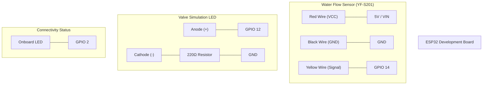

# AgriFlow ESP32 Node: Hardware Wiring Guide

This guide details the physical connections required to set up the AgriFlow water monitoring node using an ESP32, a flow sensor, and simulation LEDs.

## 1. Component List
*   **ESP32 DevKit V1** (or compatible 30/38 pin board)
*   **YF-S201 Water Flow Sensor** (5V Hall Effect)
*   **Simulation LED** (to represent the Solenoid Valve)
*   **Status LED** (optional, uses onboard Pin 2 by default)
*   **220Ω Resistor** (for the LED)
*   **Jumper Wires & Breadboard**

---

## 2. Wiring Diagram (Schematic)



---

## 3. Connection Details

| Component Wire | ESP32 Pin | Function |
| :--- | :--- | :--- |
| **Flow Sensor: Yellow** | **GPIO 14** | **Signal (Input)**: Counts pulses per Liter. |
| **Flow Sensor: Red** | **5V / VIN** | **Power (Input)**: 5V power supply. |
| **Flow Sensor: Black** | **GND** | **Ground**: Common ground reference. |
| **LED: Long Leg (+)** | **GPIO 12** | **Valve Signal (Output)**: ON when irrigating. |
| **LED: Short Leg (-)** | **GND** | Connect through 220Ω resistor to GND. |

---

## 4. Pin Definition in `CodeLogic.ino`
If you need to change pins, update these lines at the top of the code:
```cpp
const int FLOW_SENSOR_PIN = 14; 
const int VALVE_LED_PIN = 12;   
const int STATUS_LED_PIN = 2;   
```

---

## 5. Testing the Hardware
1. **Connect to USB**: Power the ESP32 through your computer.
2. **Open Serial Monitor**: Set baud rate to `115200`.
3. **Check Connection**: The onboard LED should blink until WiFi connects.
4. **Simulate Flow**: Blow air into the sensor. You should see "Flow: X L/min" in the serial monitor.
5. **Toggle Valve**: Use the AgriFlow Mobile App to "Start Irrigation." The LED on **GPIO 12** should turn **ON**.

---

## 6. Power Considerations
*   **Development**: USB power is sufficient for the sensor and LEDs.
*   **Field Deployment**: Use a 12V power supply for the actual Solenoid Valve and a step-down converter (buck converter) to provide 5V to the ESP32.
